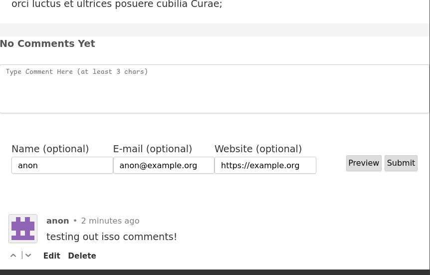

---
## Guide Information
title: "Isso"
description: A commenting server similar to disqus
icon: isso.svg
date: 2024-03-17
ports: [80, 443]

## Author Information
author: Ángel Castañeda
email: angel@acsq.me
matrix: "@acsquared:cyberia.club"

---

Isso is a free and open source commenting server for people that want simple, self-hosted comments sections for their blogs.

## Prerequisites

This guide assumes you already have a static webserver up and running with [nginx](/server/nginx) or caddy with a website roughly in this shape:

```
/var/www/example.org/
├── index.html
├── favicon.ico
├── posts
│   ├── article-1.html
│   ├── article-2.html
│   └── article-3.html
└── styles.css
```

Namely, each page you want to add comments to has its own url, as that's what isso uses to distinguish each comments section.

You also will need a new subdomain pointed to this server; this guide assumes `isso.example.org`.

## Installation

Isso is not included in Debian 12's repositories, so we're gonna need to set up a python virtual environment to install it with pip.

Install dependencies first:

```sh
# this guide assumes you are root unless otherwise stated
apt-get install python3-setuptools python3-virtualenv python3-dev
```

Then let's download the latest release and set up our virtualenv:

```sh
cd /opt
VERSION=0.13.1.dev0
curl -fLO https://github.com/isso-comments/isso/archive/refs/tags/$VERSION.tar.gz
tar xvf $VERSION.tar.gz
mv isso-$VERSION isso
```

Now, for the sake of security as well as and not breaking our root's python packages, we'll deploy our comments server with a new `isso` user:

```sh
useradd -m -d /var/lib/isso -s /usr/bin/bash isso
chown -R isso:isso /opt/isso
su isso
cd /opt/isso
virtualenv .
source ./bin/activate
pip install isso
exit
```

## Configuration

Next, as root, copy the default config file to /etc and start configuring for our site.

```sh
cp /opt/isso/isso/isso.cfg /etc/isso.cfg
```

And make the following changes to that default file in etc:

```ini
...
dbpath = /var/lib/isso/comments.db
...
hosts =
    http://example.org/
    https://example.org/
...
public_endpoint = https://isso.example.org/
...
```

This is the minimum configuration changes needed to get a working server, but you can learn about multisite hosting or RSS feeds or other optional features from the [isso docs](https://isso-comments.de/docs/reference/server-config/).

## Deployment

Now we need to run our commenting server.

### Webserver

First, let's set up our reverse proxy to it.

#### Caddy

If you're running caddy, just edit your /etc/caddy/Caddyfile with the new isso.example.org entry:

```caddyfile
example.org {
    root * /var/www/example.org
    encode gzip
    file_server
}

isso.example.org {
    reverse_proxy localhost:8080
}
```

And reload:

```sh
systemctl reload caddy
```

#### NGINX

With nginx, make a new config file at /etc/nginx/sites-available/isso.example.org:

```nginx
server {
    server_name isso.example.org;
    location / {
        proxy_pass http://127.0.0.1:8080;
        include proxy_params;
    }
    listen 80;
    listen [::]:80;
}
```

Then activate that config file:

```sh
ln -s /etc/nginx/sites-available/isso.example.org /etc/nginx/sites-enabled/isso.example.org
systemctl reload nginx
```

Then we need to get our certs:

```sh
certbot --nginx -d isso.example.org --register-unsafely-without-email
systemctl reload nginx
```

done!

### Website

Now let's set up the frontend site. If we have a structure like this:

```
/var/www/example.org/
├── index.html
├── favicon.ico
├── posts
│   ├── article-1.html
│   ├── article-2.html
│   └── article-3.html
└── styles.css
```

Go to each article's future comments section location, and add these scripts:

```html
<html>
    <!-- header+post above -->

    <script data-isso="//isso.example.org/"
         src="//isso.example.org/js/embed.min.js"></script>

    <section id="isso-thread">
         <noscript>Javascript needs to be activated to view comments.</noscript>
    </section>

    <!-- footer below -->
</html>
```

### Isso Server

Now we should be able to test out and see comments sections in our sites:

```sh
su isso
/opt/isso/bin/isso
```

While isso is running on the command line, check your site on your browser and test out your new comments section.



Let's kill the process and delete our test comments now:

```sh
rm /var/lib/isso/comments.db
exit # back to root
```

We will make a daemon to automate isso for us. Write this to /etc/systemd/system/isso.service:

```systemd
[Unit]
Description=Isso Commenting Server
Documentation=https://isso-comments.de/docs/
After=network.target
Wants=network-online.target

[Service]
Type=simple
Restart=always
ExecStart=/opt/isso/bin/isso
User=isso
Group=isso
Restart=on-failure

[Install]
WantedBy=multi-user.target
```

Activate said daemon:

```sh
systemctl daemon-reload
systemctl enable --now isso
```

Now enjoy your fully deployed commenting system!
